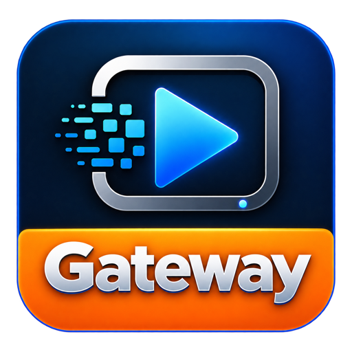
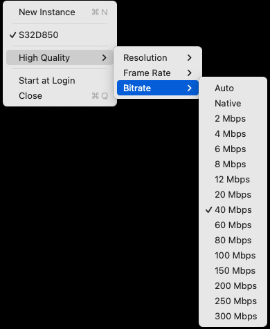
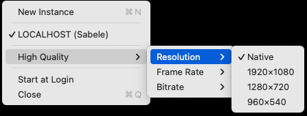
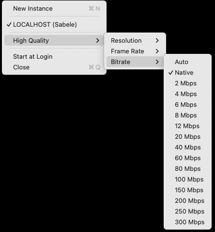
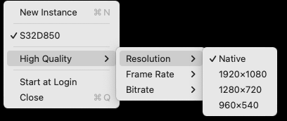

<p align="center">
  
  &nbsp;&nbsp;
  
  &nbsp;&nbsp;
  
</p>

<h1 align="center">Viso Gateway</h1>

<p align="center"><strong>One encode on the Mac. Many screens on the LAN.</strong></p>

Viso Gateway turns a source on your Mac into [Viso](https://github.com/zabelez/viso-player-releases) so [Viso Player](https://github.com/zabelez/viso-player-releases) can put it on every screen in the room.

There is no window. After you drag the app to **Applications**, a menu-bar icon is the whole interface. No license key. Conversion stops when you **Close** that instance.

This project is **in active development**. If it does not work on your Mac, [open an issue](https://github.com/zabelez/viso-gateway-releases/issues) with what you used and what you saw.

Current version: **0.3.0**. Viso Gateway and Viso Gateway NDI need **macOS 11.0** or later (Monterey 12 included). Viso Gateway Screen needs **macOS 13.0** (Ventura) or later.

There are three apps. Pick the one that matches the source you already have.

**High Quality**, in every app, sets Resolution, Frame Rate, and Bitrate for the single high stream. The low stream stays a 640-wide proxy. **Auto** and **Native** follow the source; you can also pick a fixed size, frame rate, or bitrate cap. Changing High Quality **keeps the same `viso://` URL** so Players do not need remapping for that path.

**A/V timing** in this release shares one start clock for video and audio and sends RTCP Sender Reports so [Viso Player 0.26.0](https://github.com/zabelez/viso-player-releases/releases/tag/v0.26.0) can keep lip-sync. Screen and NDI send real captured audio only (no silence fillers). Syphon stays video-only.

## Viso Gateway

For **Syphon** sources on this Mac (a capture or graphics app that publishes Syphon), and for selected **IPMX-AVC** Senders when discovery is available.

Open the app. Every visible Syphon server is published in this one instance. IPMX Senders appear in the same menu — click to publish (stable Sender UUID). Click the icon to see the list, **High Quality**, **Start at Login**, and **Close**.

Syphon is video only. Players will have picture and no audio from Syphon. IPMX-AVC ingest is a lab-proven bridge of the tested active subset — not an IPMX Certified Receiver.

<p align="center">
  
</p>

<p align="center">
  
</p>

A source already published as Viso from this Mac is marked **this Mac**. **Close** stops conversion. **Start at Login** opens the app at login and publishes Syphon sources as they appear.

Download **`Viso-Gateway-0.3.0.dmg`**.

## Viso Gateway NDI

For **one NDI source per instance**. The Mac converts that source to Viso. Players on the LAN receive Viso; they do not need an NDI decoder.

Click the icon for **New Instance** at the top, the source list in the middle, and **Close** at the bottom. If nothing is on the network yet, the list says **No sources available**. Click a source to publish it (checkmark). A source already announced as Viso on this Mac or another host is listed but disabled.

<p align="center">
  
</p>

<p align="center">
  
  
</p>

**New Instance** opens a second icon so you can publish another NDI source. **Start at Login** waits for the last selected source after reboot. **Close** stops that instance only.

`libndi` is inside the app. You do not install an NDI SDK or Runtime on the operator Mac. Allow **Local Network** if macOS asks.

Download **`Viso-Gateway-NDI-0.3.0.dmg`**.

## Viso Gateway Screen

For **one display on this Mac**, with system audio on the same Viso stream. Requires **macOS 13** or later.

Click the icon for **New Instance** at the top, the display list in the middle, and **Close** at the bottom. Click a display to publish it (checkmark). Allow **Screen Recording** when macOS asks. If you do not, the menu says **Screen Recording permission required**. There is no microphone.

**New Instance** opens a second icon so you can publish another display. **Start at Login** waits for the last selected display after reboot. **Close** stops that instance only.

<p align="center">
  
</p>

Download **`Viso-Gateway-Screen-0.3.0.dmg`**.

## Install

1. Download the DMG for the app you need from [Releases](https://github.com/zabelez/viso-gateway-releases/releases/tag/v0.3.0), and the matching `.sha256` file.
2. Verify the download:

   ```bash
   shasum -a 256 -c Viso-Gateway-0.3.0.dmg.sha256
   # or
   shasum -a 256 -c Viso-Gateway-NDI-0.3.0.dmg.sha256
   # or
   shasum -a 256 -c Viso-Gateway-Screen-0.3.0.dmg.sha256
   ```

3. Open the DMG. Drag the app onto **Applications**.
4. First launch: if macOS blocks the app, **Control-click → Open**. The build is ad-hoc signed (no Developer ID).
5. If macOS asks for **Local Network**, allow it. Discovery and Viso both need it. Viso Gateway Screen also asks for **Screen Recording**.
6. Click the menu-bar icon. For Viso Gateway NDI, pick a source. For Viso Gateway Screen, pick a display. For Viso Gateway, Syphon sources publish on their own; click an IPMX Sender when you use that path.
7. On a [Viso Player](https://github.com/zabelez/viso-player-releases) on the same LAN, open **Displays** and select the new Viso source.

You can keep all three apps installed. They are separate products.

## On the player

Players look up sources as `viso://<Mac-LAN-IP>:<control>/<source-id>`. After the Gateway is publishing, the name appears in the Viso Player source list. **Pair this release with Viso Player 0.26.0.** That Player binds by `source_id` and rediscovers if a cold-start still moves the control port, and it consumes the A/V timing from this Gateway. High Quality changes on Gateway 0.3.0 keep the URL stable.

## Downloads

| File | Purpose |
|------|---------|
| `Viso-Gateway-0.3.0.dmg` | Syphon / IPMX-AVC → Viso. Drag to Applications. macOS 11+. |
| `Viso-Gateway-0.3.0.dmg.sha256` | Verify that image |
| `Viso-Gateway-NDI-0.3.0.dmg` | One NDI source → Viso. Drag to Applications. macOS 11+. |
| `Viso-Gateway-NDI-0.3.0.dmg.sha256` | Verify that image |
| `Viso-Gateway-Screen-0.3.0.dmg` | One display + system audio → Viso. Drag to Applications. macOS 13+. |
| `Viso-Gateway-Screen-0.3.0.dmg.sha256` | Verify that image |

Windows is not in this release.

## Talk to us

This project grows with the rooms that try it.

- [Open an issue](https://github.com/zabelez/viso-gateway-releases/issues) with the Mac you used, which app (Gateway, Gateway NDI, or Gateway Screen), the source, and what you saw on the player.
- Follow [Facebook](https://www.facebook.com/ndiplayer) and [Instagram](https://www.instagram.com/ndiplayer). Photos and short videos from your room are welcome.

We want to learn from real installs. Tell us what is missing.
