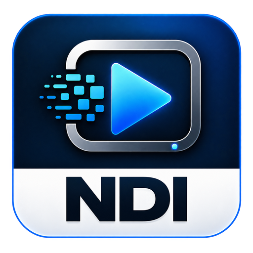
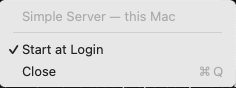
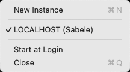

<p align="center">
  
  &nbsp;&nbsp;
  
</p>

<h1 align="center">Viso Gateway</h1>

<p align="center"><strong>One encode on the Mac. Many screens on the LAN.</strong></p>

Viso Gateway turns a source on your Mac into [Viso](https://github.com/zabelez/viso-player-releases) so [Viso Player](https://github.com/zabelez/viso-player-releases) can put it on every screen in the room.

There is no window. After you drag the app to **Applications**, a menu-bar icon is the whole interface. No license key. Conversion stops when you **Close** that instance.

This project is **in active development**. If it does not work on your Mac, [open an issue](https://github.com/zabelez/viso-gateway-releases/issues) with what you used and what you saw.

Current version: **0.1.0** (macOS 11.0 or later, including Monterey 12).

There are two apps. Pick the one that matches the source you already have.

## Viso Gateway

For **Syphon** sources on this Mac (OBS, a capture app, a graphics tool).

Open the app. Every visible Syphon server is published in this one instance. Click the icon to see the list, **Start at Login**, and **Close**.

Syphon is video only. Players will have picture and no audio from this app.

<p align="center">
  
</p>

A source already published as Viso from this Mac is marked **this Mac**. **Close** stops conversion. **Start at Login** opens the app at login and publishes Syphon sources as they appear.

Download **`Viso-Gateway-0.1.0.dmg`**.

## Viso Gateway NDI

For **one NDI source per instance**. The Mac converts that source to Viso. Players on the LAN receive Viso; they do not need an NDI decoder.

Click the icon for **New Instance** at the top, the source list in the middle, and **Close** at the bottom. If nothing is on the network yet, the list says **No sources available**. Click a source to publish it (checkmark). A source already announced as Viso on this Mac or another host is listed but disabled.

<p align="center">
  
</p>

**New Instance** opens a second icon so you can publish another NDI source. **Start at Login** waits for the last selected source after reboot. **Close** stops that instance only.

`libndi` is inside the app. You do not install an NDI SDK or Runtime on the operator Mac. Allow **Local Network** if macOS asks.

Download **`Viso-Gateway-NDI-0.1.0.dmg`**.

## Install

1. Download the DMG for the app you need from [Releases](https://github.com/zabelez/viso-gateway-releases/releases/tag/v0.1.0), and the matching `.sha256` file.
2. Verify the download:

   ```bash
   shasum -a 256 -c Viso-Gateway-0.1.0.dmg.sha256
   # or
   shasum -a 256 -c Viso-Gateway-NDI-0.1.0.dmg.sha256
   ```

3. Open the DMG. Drag the app onto **Applications**.
4. First launch: if macOS blocks the app, **Control-click → Open**. The build is ad-hoc signed (no Developer ID).
5. If macOS asks for **Local Network**, allow it. Discovery and Viso both need it.
6. Click the menu-bar icon. For Viso Gateway NDI, pick a source. For Viso Gateway, Syphon sources publish on their own.
7. On a [Viso Player](https://github.com/zabelez/viso-player-releases) on the same LAN, open **Displays** and select the new Viso source.

You can keep both apps installed. They are separate products.

## On the player

Players look up sources as `viso://<Mac-LAN-IP>:<control>/<source-name>`. After the Gateway is publishing, the name appears in the Viso Player source list. Pair this release with **Viso Player 0.24.0** or later.

## Downloads

| File | Purpose |
|------|---------|
| `Viso-Gateway-0.1.0.dmg` | Syphon → Viso. Drag to Applications. |
| `Viso-Gateway-0.1.0.dmg.sha256` | Verify that image |
| `Viso-Gateway-NDI-0.1.0.dmg` | One NDI source → Viso. Drag to Applications. |
| `Viso-Gateway-NDI-0.1.0.dmg.sha256` | Verify that image |

Windows is not in this release.

## Talk to us

This project grows with the rooms that try it.

- [Open an issue](https://github.com/zabelez/viso-gateway-releases/issues) with the Mac you used, which app (Gateway or Gateway NDI), the source, and what you saw on the player.
- Follow [Facebook](https://www.facebook.com/ndiplayer) and [Instagram](https://www.instagram.com/ndiplayer). Photos and short videos from your room are welcome.

We want to learn from real installs. Tell us what is missing.
